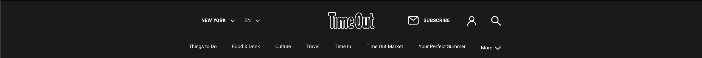

# Procesverslag
**Auteur:** -jouw naam-

Markdown cheat cheet: [Hulp bij het schrijven van Markdown](https://github.com/adam-p/markdown-here/wiki/Markdown-Cheatsheet). Nb. de standaardstructuur en de spartaanse opmaak zijn helemaal prima. Het gaat om de inhoud van je procesverslag. Besteedt de tijd voor pracht en praal aan je website.

## Bronnenlijst
1. -bron 1-
2. -bron 2-
3. -...-

## Eindgesprek (week 7/8)

-dit ging goed & dit was lastig-

**Screenshot(s):**

-screenshot(s) van je eindresultaat-

## Voortgang 3 (week 6)

-same as voortgang 1-

## Voortgang 2 (week 5)

-same as voortgang 1-

## Voortgang 1 (week 3)

### Stand van zaken

-dit ging goed & dit was lastig-

**Screenshot(s):**

-screenshot(s) van hoe ver je bent-

### Agenda voor meeting

-samen met je groepje opstellen-

### Verslag van meeting

-na afloop snel uitkomsten vastleggen-

## Intake (week 1)

**Je startniveau:** Blauw

**Je focus:** Responsive

**Je opdracht:** Ik ga de website van IMDB na maken waarbij je zelf je eigen lijst kan maken met welke films jouw favorieten zijn. Hierbij komt een beschrijving van de film bij met afbeelding. Dit is een uitdaging omdat ik Hieronder een link naar de site van hoe het nu is. 
https://www.imdb.com/list/ls021649644/ 

**Screenshot(s):**

[Foto](images/Foto1.png)
[Foto2](images/Foto2.png)
[Footer](images/Footer.png)

**Breakdown-schets(en):**

